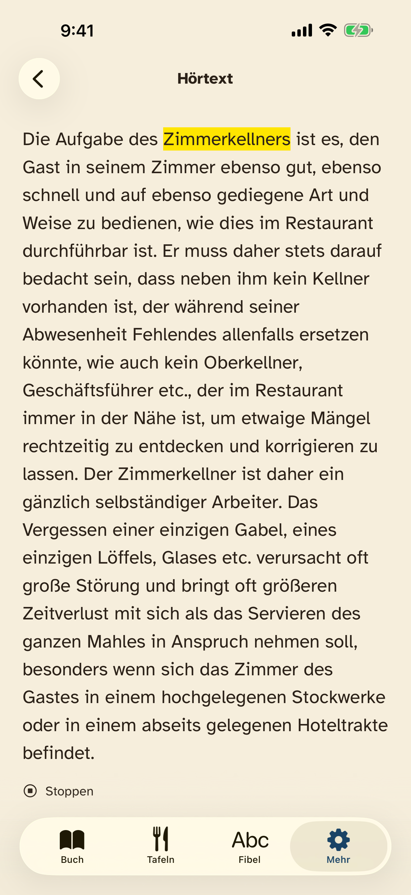

# Prüfung der Vertonungsschnittstelle · 10.09.2026

Die Schnittstelle exportiert den vorhandenen Buch- und Lernbestand, prüft fremd erzeugte
Aufnahmen und liest sie in die App-Ressourcen ein. Die Vorbereitung hat keine neue Sprache
erzeugt. Für die Prüfung wurden vorhandene Buchaufnahmen verwendet.

| Prüfung | Ergebnis |
|---|---|
| Gesamte Python-Suite | 122 Tests bestanden; davon 26 für den Audioaustausch |
| Vollständigkeit | 1.171 eindeutige Aufträge, 33.492 Anzeigetokens; alle alphanumerischen Zeichen abgedeckt |
| Bestehender Reader | Alle 87 Track-Zuordnungen und Textsegmente stimmen mit der bestehenden App überein |
| Quellen | Kapitel-/Lerntext, Bilder und bestehende Audiodateien im App-Bestand unverändert |
| Import | Bestehender Track und ergänzende Einzelaufnahme mit FFmpeg geprüft, konvertiert und in isolierte Kopien eingelesen |
| Fehlerfälle | Veralteter Textstand, falsche IDs/Hashes, fehlende/überlappende/ungültige Zeiten, defekte Dateien und unzulässige Pfade abgelehnt |
| Sicherung | Vorheriger Stand vollständig gesichert; gleicher Import wiederholbar ohne weitere Änderung |
| iOS | 19 Unit-Tests bestanden; vier Aufnahmentests nach abschließender Änderung erneut bestanden |
| iPhone und iPad | Hörtextliste öffnen, suchen, Aufnahme starten/stoppen; je ein UI-Test bestanden |
| Wortmarkierung | Screenshot zeigt das tatsächlich gesprochene Wort aus einer vorhandenen Aufnahme |
| ZIP | Entpackt; Export aus dem Paket erzeugt dasselbe Manifest wie das Repository |

Simulator: iPhone 17 Pro Max und iPad Pro 13, iOS 26.5, Xcode 26.6.
Die UI-Prüffassung enthält eine separate Referenz auf einen vorhandenen Absatz aus Kapitel 10;
diese Testreferenz gehört nicht zum ausgelieferten `Content/Audio`-Ordner.

Die Tests prüfen Format, Zuordnung, Sicherung und Wiedergabe. Die Aussprache und Vollständigkeit
einer späteren LLM-Lieferung muss zusätzlich am tatsächlichen Audio gegengehört werden.
TestFlight enthält weiterhin Build 1.0 (3); für gelieferte Aufnahmen ist ein neuer App-Build nötig.
